# Multilevel RF Power Detector
**Dual-Band 433 MHz / 915 MHz RF Presence Indicator**

---

## General Description

The **Multilevel RF Power Detector** is a compact dual-band RF sensing device designed to detect and visually indicate the relative power of radio-frequency signals in the **433 MHz** and **915 MHz** ISM bands. The system employs band-pass filtering, low-noise amplification, and logarithmic detection to provide reliable RF presence indication using a multi-level LED display.

The device is intended for educational, laboratory, and experimental RF applications where quick visual feedback is required without the use of complex RF measurement equipment.

---

## Key Features

- Dual-band RF detection: 433 MHz and 915 MHz
- Logarithmic RF power detection
- Multi-level LED signal strength indication
- RF-optimized PCB layout
- Single DC supply operation
- Compact and portable design

---

## Applications

- ISM band signal monitoring
- RF laboratory demonstrations
- Educational RF experiments
- RF activity detection
- Wireless system debugging

---

## Functional Block Diagram

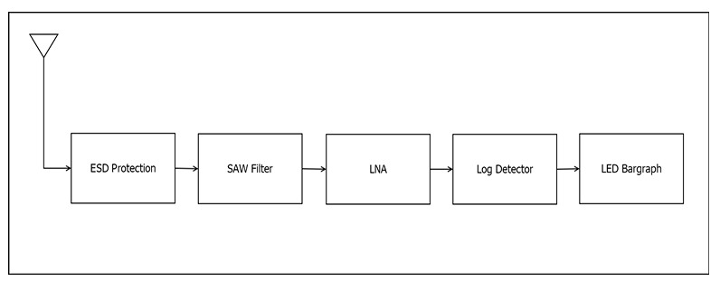

---

## Electrical Characteristics

| Parameter | Typical Value |
|---------|---------------|
| Supported Frequency Bands | 433 MHz, 915 MHz |
| Input Impedance | 50 Ω |
| LNA Gain | 433 MHz: 20.3 dB 915 MHz: 17.9 dB |
| Noise Figure | 433 MHz: 2.3 dB 915 MHz: 2.8 dB |
| Supply Voltage (Nominal) | 9 V |
| Supply Current | 200 mA |

---

## LED Signal Indication

| LED Status | RF Power Level (Relative) |
|-----------|---------------------------|
| 1 LED ON | Very Low |
| 2–3 LEDs ON | Low to Medium |
| 4–5 LEDs ON | Medium to High |
| All LEDs ON | High RF Power |

---

## Power Supply

- Single DC supply operation
- On-board voltage regulation

---

## Mechanical Information

| Parameter | Specification |
|---------|---------------|
| PCB Dimensions | 126.37 mm × 129 mm |
| Antenna Connector | SMA Edge-Mount |
| Enclosure | Custom Enclosure |

---

## Mechanical Drawings

**Mechanical Drawing – Page 1**  
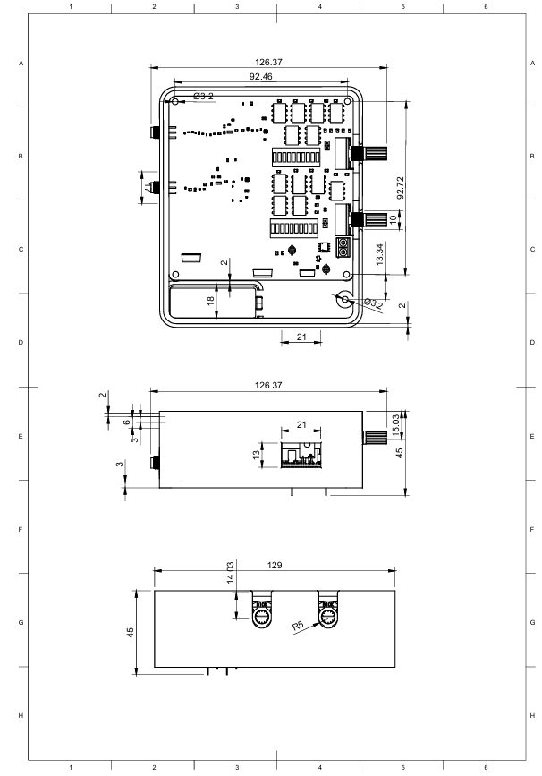

**Mechanical Drawing – Page 2 (Assembly Views)**  
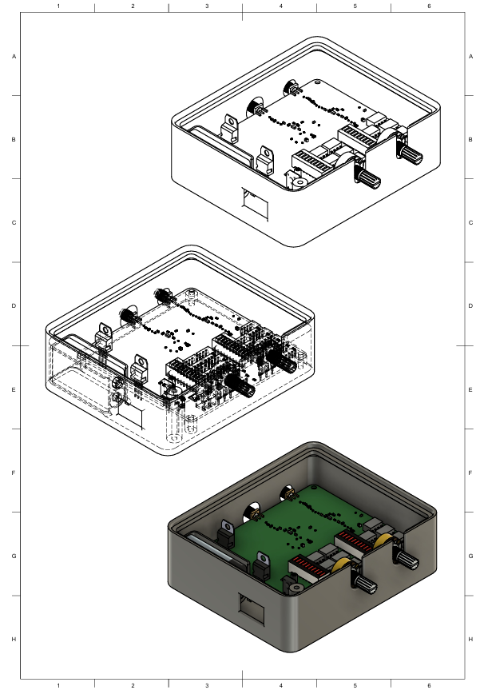

---

## Schematics

### 433 MHz Section
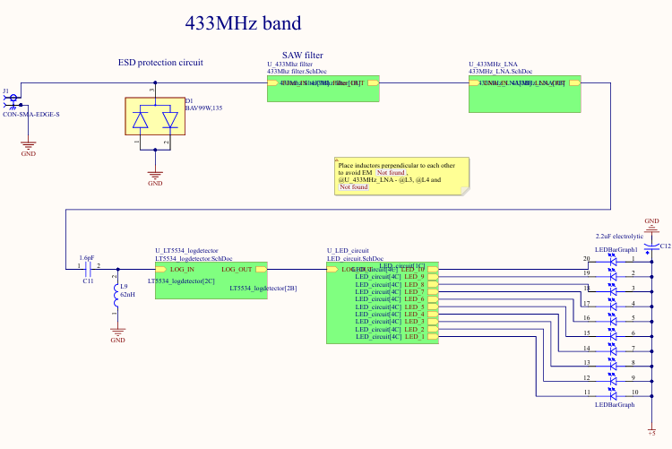

### 433 MHz LNA Design
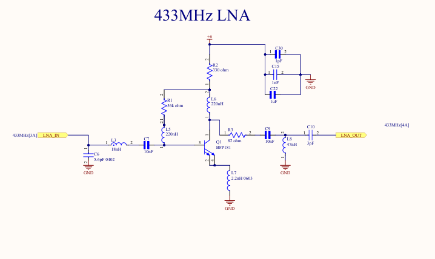

### LED Driver Circuit
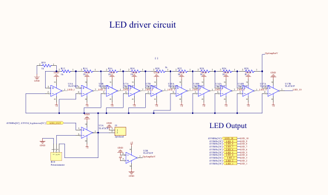

### Log Detector Circuit
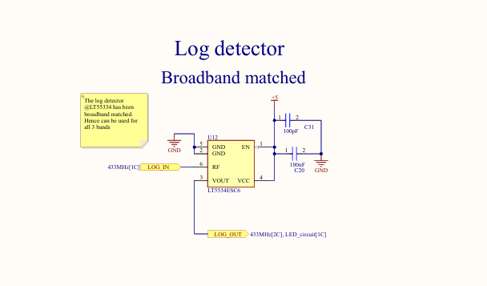

### 433 MHz Band-Pass Filter
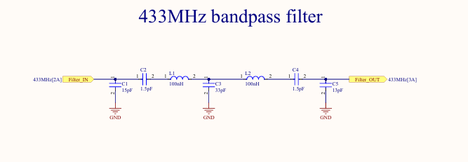

### 915 MHz Section
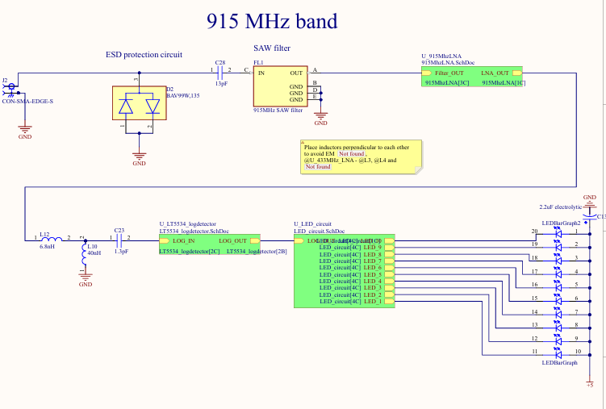

### 915 MHz LNA Design
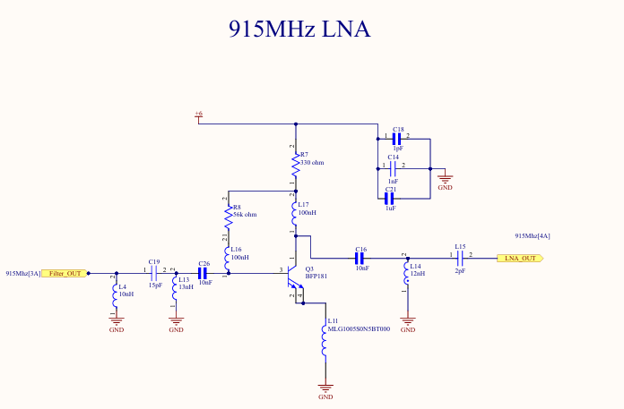

### Power Supply Design
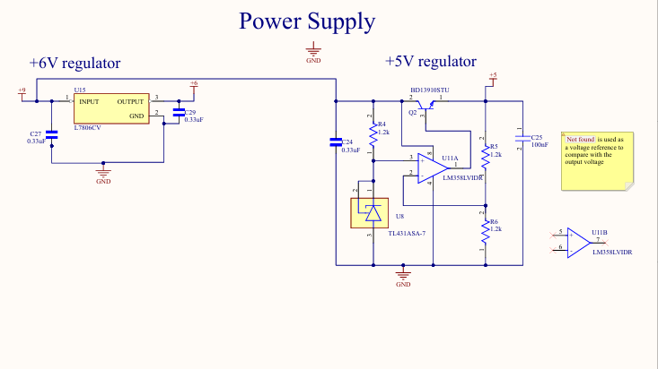

---

## PCB Layout

### Top Layer

### RF Ground Layer (Layer 2)
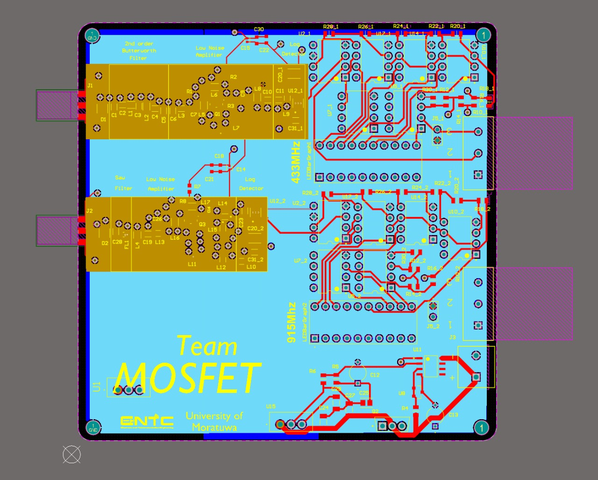

### PCB Ground Layer (Layer 3)
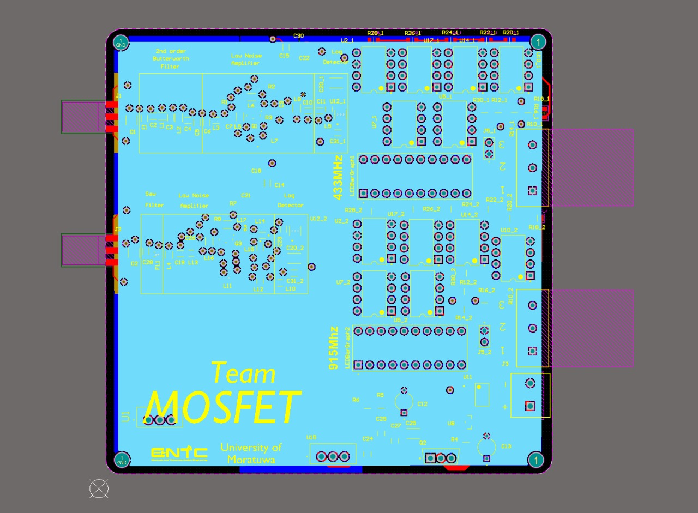

### Bottom Layer
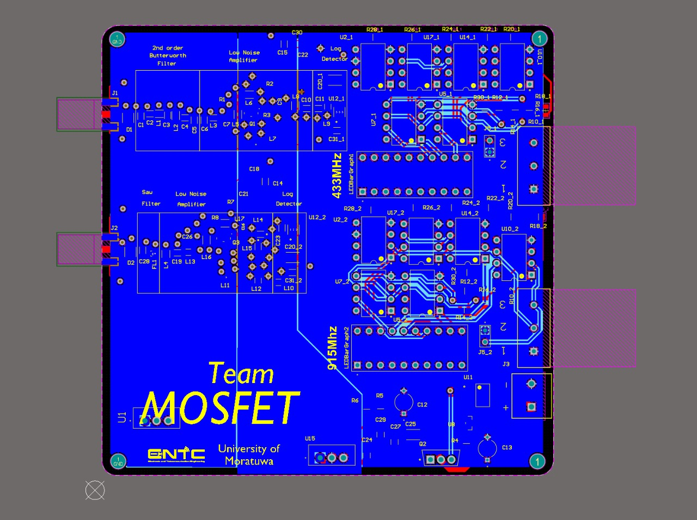

### PCB Stack-Up
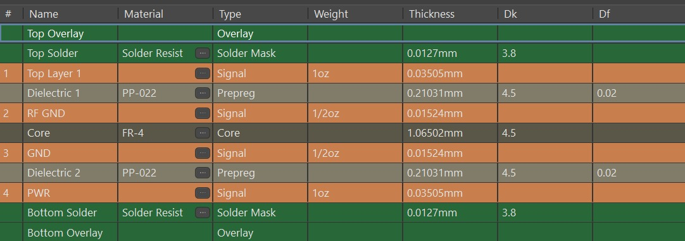

### 3D PCB View
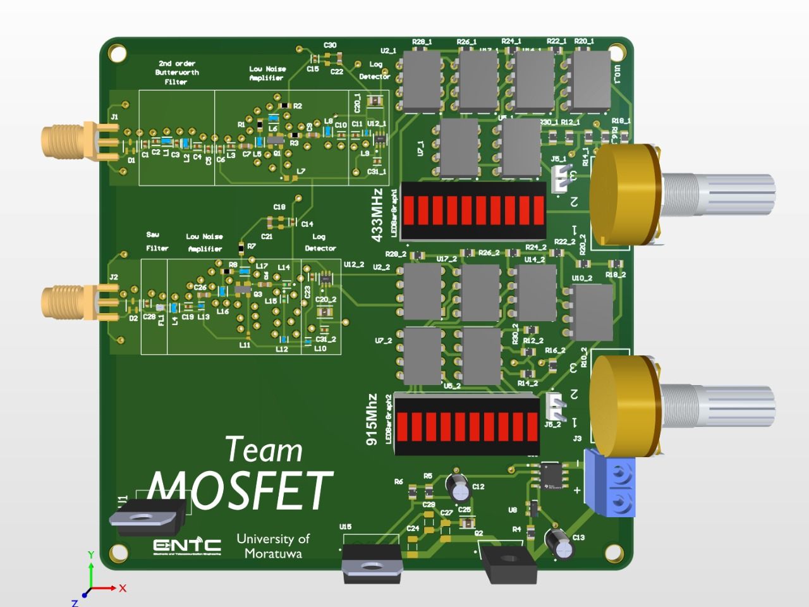

---

## Frequency Response

### 433 MHz Band
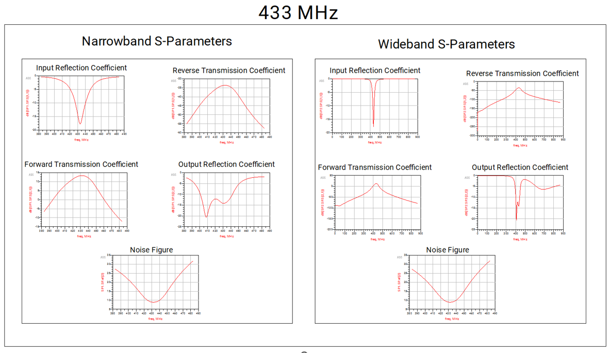

### 915 MHz Band
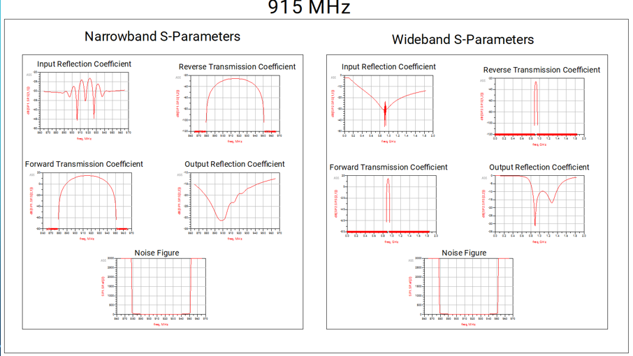

---

## Final Product

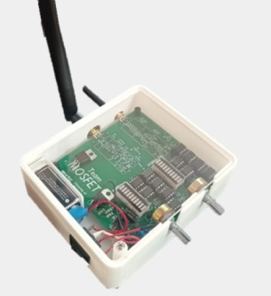

---

## Handling and Precautions

- Device contains ESD-sensitive RF components
- Avoid hot-plugging the antenna
- Do not exceed the maximum supply voltage
- Use only matched SMA antennas

---

## Disclaimer

This product is intended for educational and experimental use only. It is not a calibrated RF power measurement instrument. Specifications are subject to change without notice.

---

**Department of Electronic & Telecommunication Engineering**  
**University of Moratuwa, Sri Lanka**

